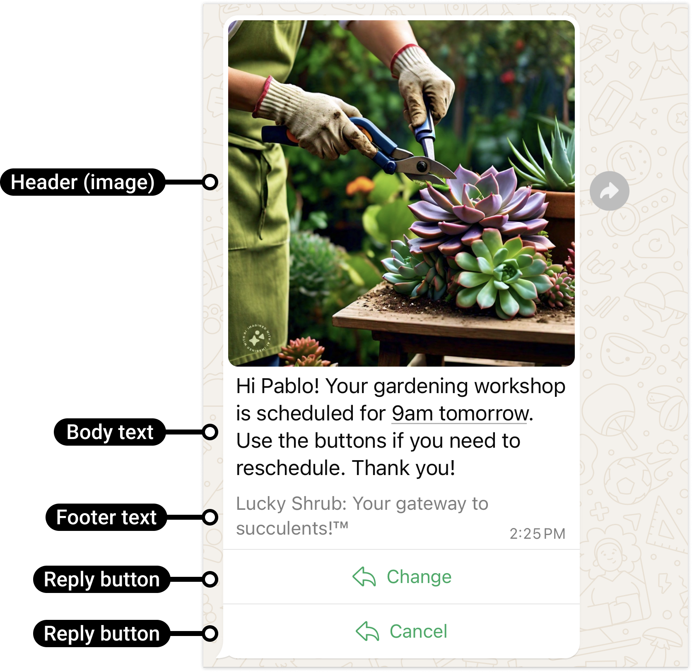

# Text with Reply Buttons

[<Badge type="tip" text="api docs" />](https://developers.facebook.com/docs/whatsapp/cloud-api/messages/interactive-reply-buttons-messages)



The `sendButtonMessage` method sends a text message with up to three reply buttons. Tapping a button sends the user back with a button-reply event the server can read via `handleWebhook`.

```ts
async sendButtonMessage({
  to,
  data
}: {
  to: string
  data:
    | { type: 'button'; action: { buttons: Array<{ type: 'reply'; reply: { id: string; title: string } }> }; body?: { text: string }; footer?: { text: string } }
    | { text: string; buttons: Array<{ id: string; title: string }>; footer?: string }
}): Promise<Result<MessageResponse, ErrorBuilder<{ code: 'SEND_REPLY_BUTTON_MESSAGE_ERROR' }>>>
```

The two union members are the same shape, just different in styling — the plain `{ text, buttons }` form is the common case. Pass the raw `interactive` form when you need the full `body`/`footer` styling.

> [!IMPORTANT]
> Max 3 buttons per message
>
> Max 20 chars per button text

## Parameters

- `to`: Recipient phone number.
- `data`: Either the simplified `{ text, buttons, footer? }` or the full `interactive` payload.

## Return

A `Result`.

- **Ok** — `MessageResponse`.
- **Err** — `code: 'SEND_REPLY_BUTTON_MESSAGE_ERROR'`.

## Limitations

- Body text: 1024 chars
- Button ID: 256 chars
- Button text: 20 chars
- Max buttons: 3

## Example usage

```ts
import { WsApi } from 'ws-cloud-api'

const ws = new WsApi()

await ws.sendButtonMessage({
  to: '573123456789',
  data: {
    text: 'This is a test message with buttons',
    buttons: [
      { id: '1', title: 'Button 1' },
      { id: '2', title: 'Button 2' }
    ]
  }
})
```
