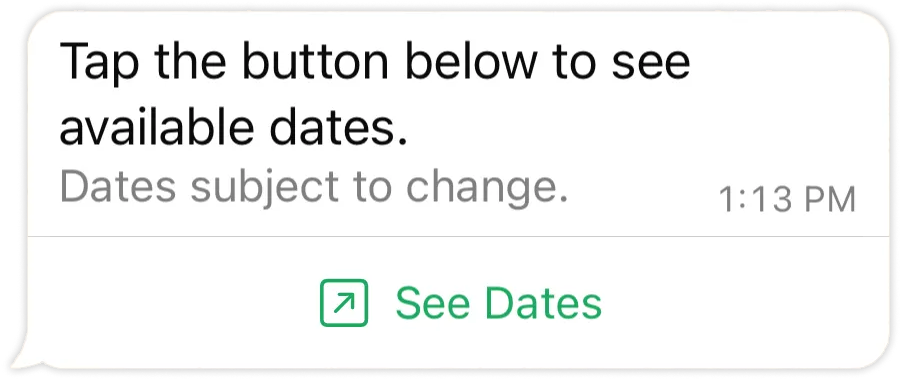

# Text with CTA Button

[<Badge type="tip" text="api docs" />](https://developers.facebook.com/docs/whatsapp/cloud-api/messages/interactive-cta-url-messages)



The `sendCTAButtonMessage` method sends a text message with a single Call-To-Action button that opens a URL on tap.

```ts
async sendCTAButtonMessage({
  to,
  data
}: {
  to: string
  data:
    | { type: 'cta_url'; action: { name: 'cta_url'; parameters: { display_text: string; url: string } }; body?: { text: string }; footer?: { text: string } }
    | { text: string; buttonText: string; url: string; footer?: string }
}): Promise<Result<MessageResponse, ErrorBuilder<{ code: 'SEND_CTA_URL_MESSAGE_ERROR' }>>>
```

The two union members describe the same shape, just differently styled. The simplified `{ text, buttonText, url, footer? }` form is the common case.

## Parameters

- `to`: Recipient phone number.
- `data.text`: The body text.
- `data.buttonText`: The text on the button (what the user taps).
- `data.url`: The URL the button opens.
- `data.footer`: Optional footer text.

## Return

A `Result`.

- **Ok** — `MessageResponse`.
- **Err** — `code: 'SEND_CTA_URL_MESSAGE_ERROR'`.

## Example usage

```ts
import { WsApi } from 'ws-cloud-api'

const ws = new WsApi()

await ws.sendCTAButtonMessage({
  to: '573123456789',
  data: {
    text: 'This is a test message with CTA button',
    buttonText: 'Visit Google',
    url: 'https://www.google.com'
  }
})
```
