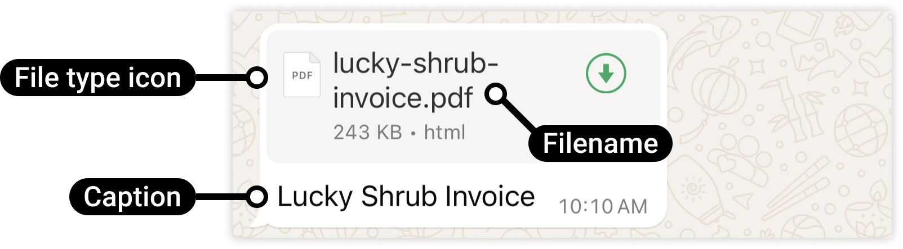

# Document

[<Badge type="tip" text="api docs" />](https://developers.facebook.com/docs/whatsapp/cloud-api/messages/document-messages)



The `sendDocument` method sends a document (PDF, Word, etc.) by media ID or direct URL.

```ts
async sendDocument({
  to,
  data
}: {
  to: string
  data: { id?: string; link?: string; caption?: string; filename?: string }
}): Promise<Result<MessageResponse, ErrorBuilder<{ code: 'SEND_DOCUMENT_MESSAGE_ERROR' }>>>
```

Provide exactly one of `id` or `link`. `filename` overrides the display name when sending by link.

## Parameters

- `to`: Recipient phone number.
- `data.id`: Media ID returned by `uploadMedia`.
- `data.link`: Direct URL to the document.
- `data.caption`: Optional caption.
- `data.filename`: Display name when sending by `link` (overrides what the URL would imply).

## Return

A `Result`.

- **Ok** — `MessageResponse`.
- **Err** — `code: 'SEND_DOCUMENT_MESSAGE_ERROR'`.

## Example usage

```ts
import { WsApi } from 'ws-cloud-api'

const ws = new WsApi()

await ws.sendDocument({
  to: '573123456789',
  data: {
    link: 'https://example.com/document.pdf',
    filename: 'document.pdf',
    caption: 'Example document'
  }
})
```
