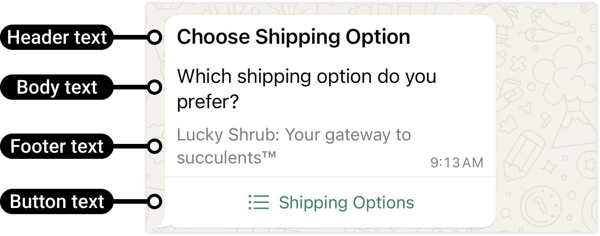
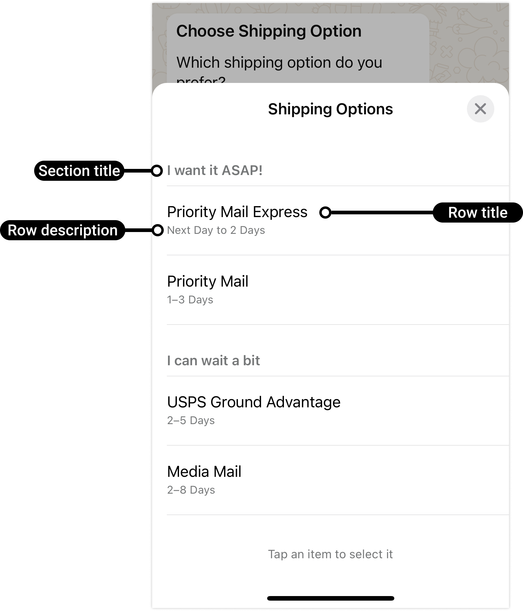

# Text with List

[<Badge type="tip" text="api docs" />](https://developers.facebook.com/docs/whatsapp/cloud-api/messages/interactive-list-messages)




The `sendInteractiveListMessage` method sends a text message with an interactive list. Lists can have a single section or multiple sections.

```ts
async sendInteractiveListMessage({
  to,
  data
}: {
  to: string
  data:
    | { type: 'list'; action: { button: string; sections: Array<{ title?: string; rows: Array<{ id: string; title: string; description?: string }> }> }; body: { text: string } }
    | {
        text: string
        buttonText: string
        list: Array<{ title: string; description?: string }>
      }
    | {
        text: string
        buttonText: string
        sections: Array<{ sectionTitle: string; listItems: Array<{ title: string; description?: string }> }>
      }
}): Promise<Result<MessageResponse, ErrorBuilder<{ code: 'SEND_INTERACTIVE_LIST_MESSAGE_ERROR' }>>>
```

The three union members: the raw `interactive` payload, the single-section simplified form, and the multi-section simplified form.

> [!IMPORTANT]
> Max 10 list items per message
>
> Max 24 chars per item title
>
> Max 72 chars per item description
>
> Max 10 sections

## Parameters

- `to`: Recipient phone number.
- `data.text`: The body text.
- `data.buttonText`: The text on the list button.
- `data.list`: A single-section list of `{ title, description? }` items.
- `data.sections`: A multi-section list — each section has `sectionTitle` and `listItems` (a flat array of `{ title, description? }`).

## Return

A `Result`.

- **Ok** — `MessageResponse`.
- **Err** — `code: 'SEND_INTERACTIVE_LIST_MESSAGE_ERROR'`.

## Example usage

### Single section

```ts
import { WsApi } from 'ws-cloud-api'

const ws = new WsApi()

await ws.sendInteractiveListMessage({
  to: '573123456789',
  data: {
    text: 'Please select an option',
    buttonText: 'Select',
    list: [
      { title: 'Option 1', description: 'Description 1' },
      { title: 'Option 2', description: 'Description 2' }
    ]
  }
})
```

### Multiple sections

```ts
await ws.sendInteractiveListMessage({
  to: '573123456789',
  data: {
    text: 'Select an option from the sectioned list',
    buttonText: 'Choose',
    sections: [
      {
        sectionTitle: 'Section 1',
        listItems: [
          { title: 'Item 1', description: 'Description 1' },
          { title: 'Item 2', description: 'Description 2' }
        ]
      },
      {
        sectionTitle: 'Section 2',
        listItems: [
          { title: 'Item 3', description: 'Description 3' },
          { title: 'Item 4', description: 'Description 4' }
        ]
      }
    ]
  }
})
```

## Limitations

- Body text: 4096 chars
- Button text: 20 chars
- Row ID: 200 chars
- Row title: 24 chars
- Row description: 72 chars
- Section title: 24 chars
- Max rows: 10
- Max sections: 10
