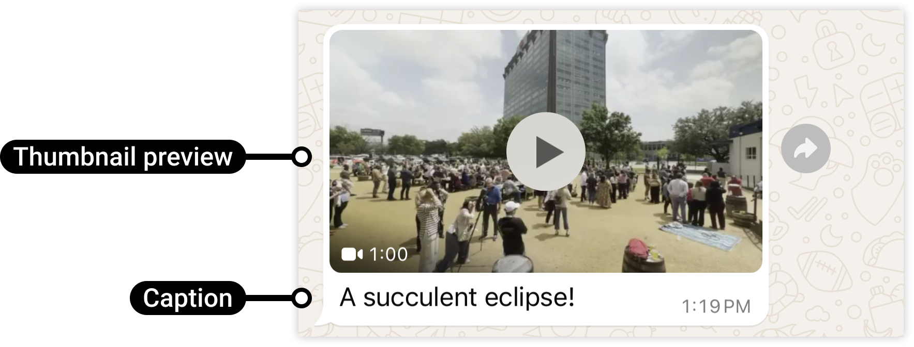

# Video

[<Badge type="tip" text="api docs" />](https://developers.facebook.com/docs/whatsapp/cloud-api/messages/video-messages)



The `sendVideo` method sends a video by media ID or direct URL.

```ts
async sendVideo({
  to,
  data
}: {
  to: string
  data: { id?: string; link?: string; caption?: string }
}): Promise<Result<MessageResponse, ErrorBuilder<{ code: 'SEND_VIDEO_MESSAGE_ERROR' }>>>
```

Provide exactly one of `id` or `link`. `caption` is optional.

## Parameters

- `to`: Recipient phone number.
- `data.id`: Media ID returned by `uploadMedia`.
- `data.link`: Direct URL to the video.
- `data.caption`: Optional caption shown beneath the video.

## Return

A `Result`.

- **Ok** — `MessageResponse`.
- **Err** — `code: 'SEND_VIDEO_MESSAGE_ERROR'`.

## Example usage

```ts
import { WsApi } from 'ws-cloud-api'

const ws = new WsApi()

await ws.sendVideo({ to: '573123456789', data: { link: 'https://example.com/video.mp4' } })
```
