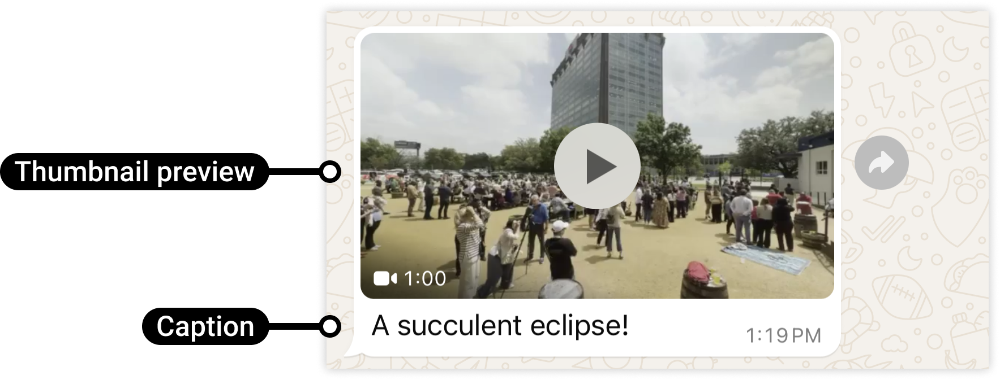

# Video

[<Badge type="tip" text="api docs" />](https://developers.facebook.com/docs/whatsapp/cloud-api/messages/video-messages)



The `sendVideo` function allows you to send a video to a WhatsApp number using a direct URL.

```ts
async function sendVideo({
  to,
  link,
  config,
}: {
  to: string;
  link: string;
  config?: WsConfig;
}): Promise<SendMessageResponse>;
```

> [!NOTE]
> Support for **caption** coming soon.

## Parameters:

- `to`: The WhatsApp phone number recipient, including country code.
- `link`: The URL of the video to send.
- `config`: Optional configuration settings.

## Return

- **Success:** True for success, false for fail.
- **Response:** Information about the message sent, like the message ID, delivery status, and more.

## Example usage

```ts
import { sendVideo } from "ws-cloud-api/messaging";

sendVideo({
  to: "573123456789",
  link: "https://example.com/video.mp4",
})
  .then((response) => {
    if (response.success) {
      console.log("Video sent");
    }
  })
  .catch(console.error);
```
