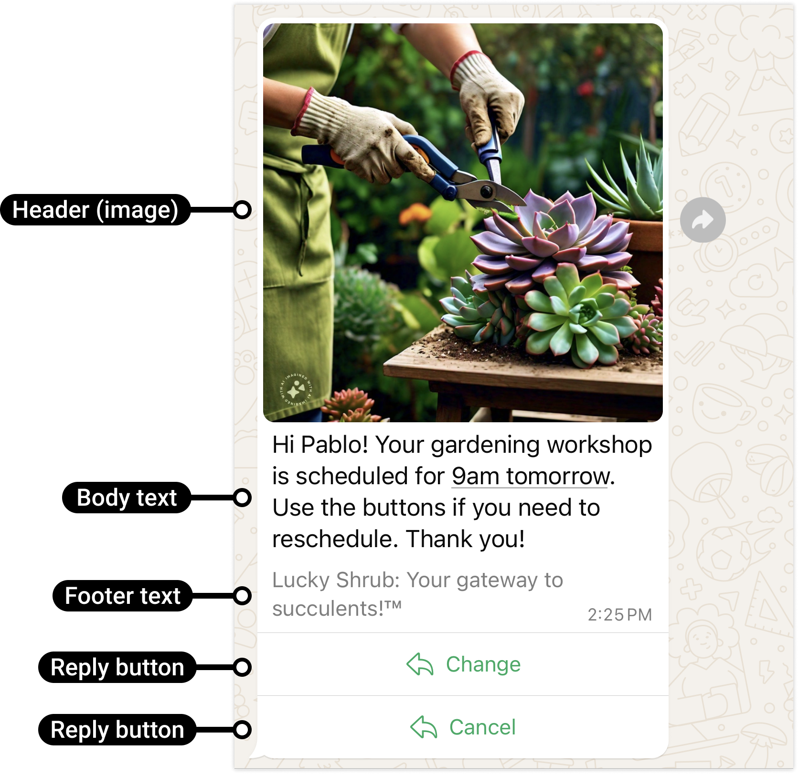

# Text with Buttons

[<Badge type="tip" text="api docs" />](https://developers.facebook.com/docs/whatsapp/cloud-api/messages/interactive-reply-buttons-messages)



The `sendTextWithButtons` function allows you to send a text message with multiple buttons to a WhatsApp number.

```ts
async function sendTextWithButtons({
  to,
  message,
  config,
}: {
  to: string;
  message: {
    text: string;
    buttons: Array<{
      title: string;
      id: string;
    }>;
  };
  config?: WsConfig;
}): Promise<boolean>;
```

> [!NOTE]
> Support for **header** and **footer** coming soon.

> [!IMPORTANT]
> Max 3 buttons for message
>
> Max 20 char for button text

## Parameters:

- `to`: The WhatsApp phone number recipient, including country code.
- `message.text`: The main text message content.
- `message.buttons`: An array of buttons, where each button has a title and an id.
- `config`: Optional configuration settings.

## Return

- **Success:** True for success, false for fail.


## Example usage

```ts
import { sendTextWithButtons } from "ws-cloud-api/messaging";

sendTextWithButtons({
  to: "573123456789",
  message: {
    text: "This is a test message with buttons",
    buttons: [
      {
        title: "Button 1",
        id: "1",
      },
      {
        title: "Button 2",
        id: "2",
      },
    ],
  },
})
  .then((sentSuccess) => {
    if (sentSuccess) {
      console.log("Message with buttons sent");
    }
  })
  .catch(console.error);
```