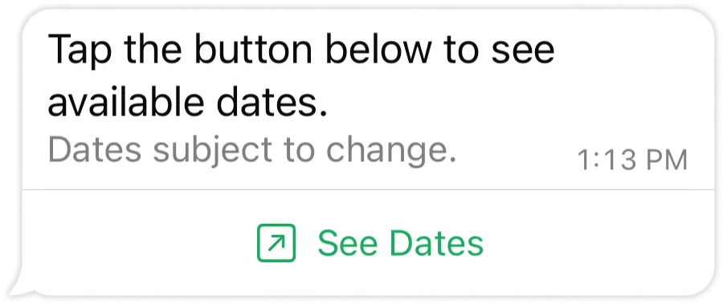

# Text with CTA Button

[<Badge type="tip" text="api docs" />](https://developers.facebook.com/docs/whatsapp/cloud-api/messages/interactive-cta-url-messages)



The `sendTextWithCTAButton` function allows you to send a text message with a Call-To-Action (CTA) button to a WhatsApp number.

```ts
async function sendTextWithCTAButton({
  to,
  message,
  config,
}: {
  to: string;
  message: {
    text: string;
    buttonText: string;
    url: string;
  };
  config?: WsConfig;
}): Promise<boolean>;
```

> [!NOTE]
> Support for **header** and **footer** coming soon.

## Parameters

- `to`: The WhatsApp phone number recipient, including country code.
- `message.text`: The main text message content.
- `message.buttonText`: The text displayed on the CTA button.
- `message.url`: The URL the CTA button will link to.
- `config`: Optional configuration settings.

## Return

- **Success:** True for success, false for fail.

## Example usage

```ts
import { sendTextWithCTAButton } from "ws-cloud-api/messaging";

sendTextWithCTAButton({
  to: "573123456789",
  message: {
    text: "This is a test message with CTA button",
    buttonText: "Visit Google",
    url: "https://www.google.com",
  },
})
  .then((sentSuccess) => {
    if (sentSuccess) {
      console.log("Message with CTA button sent");
    }
  })
  .catch(console.error);
```