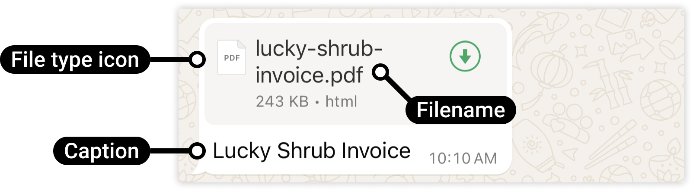

# Document

[<Badge type="tip" text="api docs" />](https://developers.facebook.com/docs/whatsapp/cloud-api/messages/document-messages)



The `sendDocument` function allows you to send a document to a WhatsApp number using a direct URL.

```ts
async function sendDocument({
  to,
  link,
  filename,
  caption,
  config,
}: {
  to: string;
  link: string;
  filename: string;
  caption?: string;
  config?: WsConfig;
}): Promise<boolean>;
```

## Parameters:

- `to`: The WhatsApp phone number recipient, including country code.
- `link`: The URL of the document to send.
- `filename`: The name of the document to display to the recipient.
- `caption`: Optional caption for the image.
- `config`: Optional configuration settings.

## Return

- **Success:** True for success, false for fail.

## Example usage

```ts
import { sendDocument } from "ws-cloud-api/messaging";

sendDocument({
  to: "573123456789",
  link: "https://example.com/document.pdf",
  filename: "document.pdf",
  caption: "Example document",
})
  .then((sentSuccess) => {
    if (sentSuccess) {
      console.log("Document sent");
    }
  })
  .catch(console.error);
```
