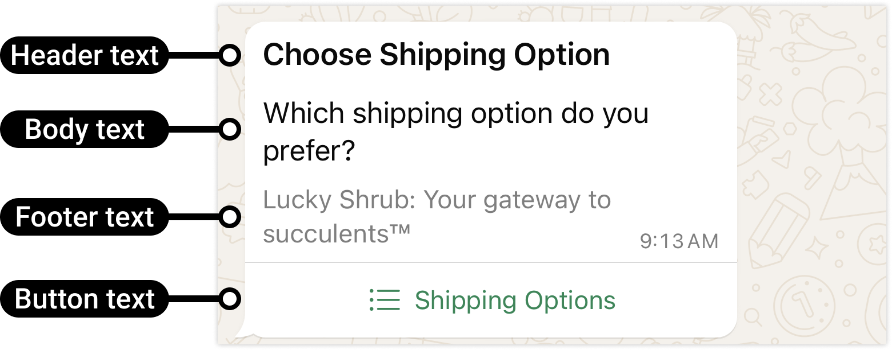
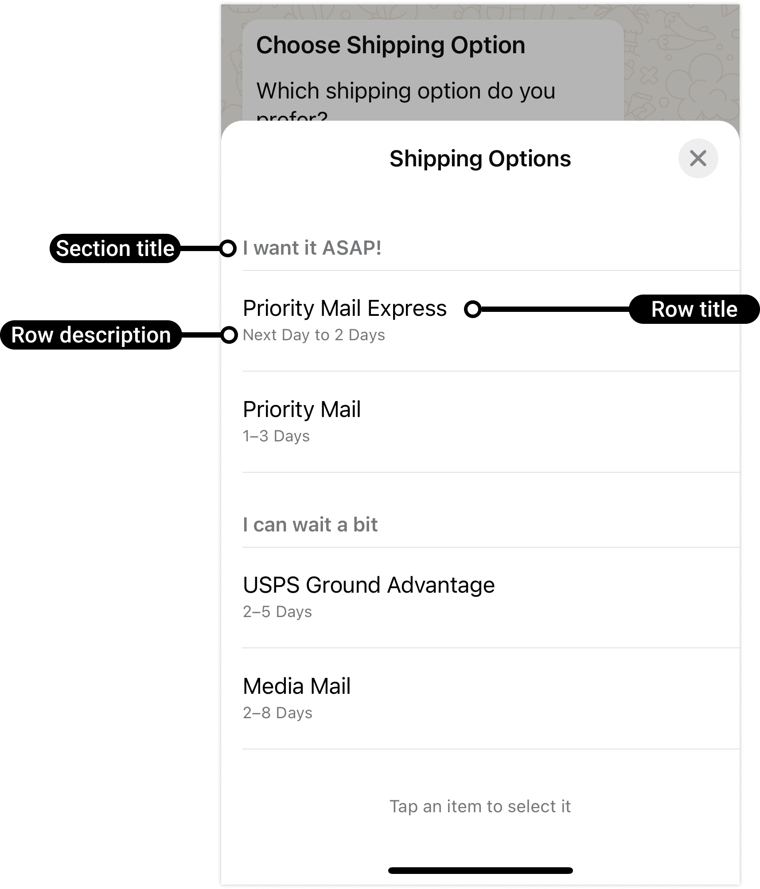

# Text with List

[<Badge type="tip" text="api docs" />](https://developers.facebook.com/docs/whatsapp/cloud-api/messages/interactive-list-messages)




The `sendInteractiveListMessage` and `sendInteractiveSectionListMessage` functions allow you to send a text message with interactive lists to a WhatsApp number. You can use these functions to create single-section lists or multi-section lists.

> [!NOTE]
> Support for **header** and **footer** coming soon.

> [!IMPORTANT]
> Max 10 list items for message
>
> Max 24 char for item title
>
> Max 72 chars for item description
>
> Max 10 sections

## `sendInteractiveListMessage`

```ts
async function sendInteractiveListMessage({
  to,
  list,
  config,
}: {
  to: string;
  list: {
    text: string;
    buttonText: string;
    list: Array<{
      title: string;
      description?: string;
    }>;
  };
  config?: WsConfig;
}): Promise<boolean>;
```

### Parameters:

- `to`: The WhatsApp phone number recipient, including country code.
- `list.text`: The main text message content.
- `list.buttonText`: The text displayed on the list button.
- `list.list`: An array of list items, where each item has a title and a description.
- `config`: Optional configuration settings.

### Return

- Success: True for success, false for fail.

### Example usage

```ts
import { sendInteractiveListMessage } from "ws-cloud-api/messaging";

sendInteractiveListMessage({
  to: "573123456789",
  list: {
    text: "Please select an option",
    buttonText: "Select",
    list: [
      {
        title: "Option 1",
        description: "Description 1",
      },
      {
        title: "Option 2",
        description: "Description 2",
      },
    ],
  },
})
  .then((sentSuccess) => {
    if (sentSuccess) {
      console.log("Message with interactive list sent");
    }
  })
  .catch(console.error);
```

## `sendInteractiveSectionListMessage`

```ts
async function sendInteractiveSectionListMessage({
  to,
  list,
  config,
}: {
  to: string;
  list: {
    text: string;
    buttonText: string;
    sections: Array<{
      sectionTitle: string;
      list: Array<{
        title: string;
        description?: string;
      }>;
    }>;
  };
  config?: WsConfig;
}): Promise<boolean>;
```

### Parameters:

- to: The WhatsApp phone number recipient, including country code.
- `list.text`: The main text message content.
- `list.buttonText`: The text displayed on the section list button.
- `list.sections`: An array of sections, where each section has a sectionTitle and a list of items with title and optional description.
- `config`: Optional configuration settings.

### Return

- Success: True for success, false for fail.

### Example usage

```ts
import { sendInteractiveSectionListMessage } from "ws-cloud-api/messaging";

sendInteractiveSectionListMessage({
  to: "573123456789",
  list: {
    text: "Select an option from the sectioned list",
    buttonText: "Choose",
    sections: [
      {
        sectionTitle: "Section 1",
        list: [
          {
            title: "Item 1",
            description: "Description 1",
          },
          {
            title: "Item 2",
            description: "Description 2",
          },
        ],
      },
      {
        sectionTitle: "Section 2",
        list: [
          {
            title: "Item 3",
            description: "Description 3",
          },
          {
            title: "Item 4",
            description: "Description 4",
          },
        ],
      },
    ],
  },
})
  .then((sentSuccess) => {
    if (sentSuccess) {
      console.log("Message with sectioned list sent");
    }
  })
  .catch(console.error);
```